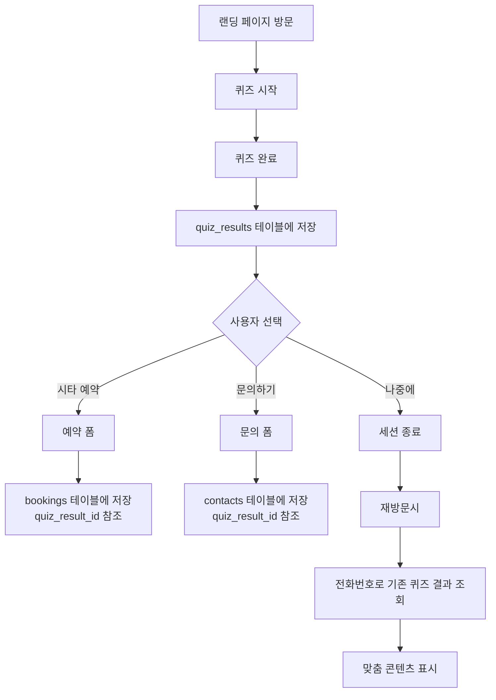

# 개선된 데이터 플로우

## 사용자 여정:



## API 호출 순서:

### 1. 퀴즈 완료 시:
```javascript
// POST /api/quiz-save
{
  name: "홍길동",
  phone: "010-1234-5678",
  swing_style: "파워형",
  priority: "비거리",
  current_distance: "230",
  recommended_flex: "S",
  expected_distance: "250",
  campaign_source: "funnel-2025-07"
}
// Response: { quiz_result_id: "uuid-xxx" }
```

### 2. 예약 시:
```javascript
// POST /api/booking-improved
{
  quiz_result_id: "uuid-xxx",  // 퀴즈에서 받은 ID
  date: "2025-07-15",
  time: "14:00",
  club: "T9"
}
```

### 3. 문의 시:
```javascript
// POST /api/contact-improved
{
  quiz_result_id: "uuid-xxx",  // 퀴즈에서 받은 ID
  inquiry_type: "상담요청",
  message: "더 자세한 설명을 듣고 싶습니다",
  preferred_contact_time: "오후 2-4시"
}
```

## 장점:

1. **데이터 일관성**: 한 고객의 정보가 한 곳에만 저장
2. **추적 개선**: 퀴즈만 하고 이탈한 고객도 추적
3. **재방문 대응**: 전화번호로 기존 데이터 조회 가능
4. **분석 강화**: 
   - 퀴즈 완료율
   - 퀴즈→예약 전환율
   - 퀴즈→문의 전환율
   - 고객별 전체 여정 추적

## 관리자 대시보드 개선:

- 퀴즈 완료 수
- 예약 전환율
- 문의 전환율
- 고객별 통합 뷰 (퀴즈 + 예약 + 문의)
