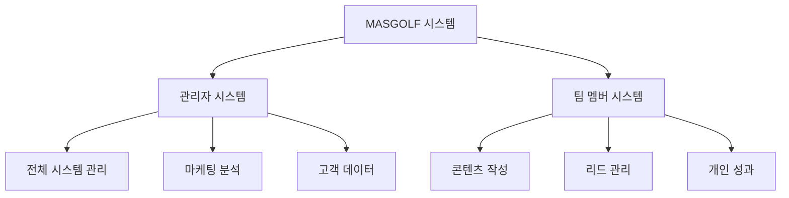

# 🏛️ 시스템 소개

[← 메인으로 돌아가기](./README.md)

---

## 🌟 MASGOLF 통합 관리 시스템이란?

  <h2>세계 최고의 마케팅 팀을 위한 완벽한 비즈니스 관리 솔루션</h2>

MASGOLF 통합 관리 시스템은 골프 여행 비즈니스를 위한 **올인원 마케팅 & 운영 플랫폼**입니다.

### 🎯 핵심 가치

<table>
  <tr>
    <td align="center" width="25%">
      <h3>📊 실시간 분석</h3>
      
마케팅 성과를 실시간으로 추적

    </td>
    <td align="center" width="25%">
      <h3>🤝 협업 도구</h3>
      
팀원 간 원활한 커뮤니케이션

    </td>
    <td align="center" width="25%">
      <h3>📈 자동화</h3>
      
반복 작업의 스마트한 자동화

    </td>
    <td align="center" width="25%">
      <h3>🔒 보안</h3>
      
고객 정보의 안전한 관리

    </td>
  </tr>
</table>

---

## 🏗️ 시스템 구조

### 1️⃣ 이중 계정 체계

### 2️⃣ 주요 모듈

#### 🏢 관리자 모듈
- **대시보드**: 전체 비즈니스 현황 한눈에 파악
- **캠페인 관리**: 구글/네이버/페이스북 광고 통합 관리
- **예약 시스템**: 고객 예약 및 일정 관리
- **상담 관리**: 고객 상담 이력 및 진행 상황
- **분석 도구**: 상세한 마케팅 ROI 분석

#### 👥 팀 멤버 모듈
- **콘텐츠 관리**: 블로그, 공지사항 작성
- **리드 추적**: 잠재 고객 관리 및 팔로우업
- **성과 대시보드**: 개인별 KPI 추적
- **협업 도구**: 팀 내 커뮤니케이션

---

## 💡 주요 기능

### 📊 실시간 대시보드

  <ul>
    <li>✅ 오늘의 예약 현황</li>
    <li>✅ 광고 성과 실시간 추적</li>
    <li>✅ 팀원별 성과 지표</li>
    <li>✅ 수익 및 비용 분석</li>
  </ul>

### 📈 마케팅 자동화

  <ul>
    <li>✅ 자동 리포트 생성</li>
    <li>✅ 이메일 마케팅 자동화</li>
    <li>✅ 소셜 미디어 일정 관리</li>
    <li>✅ A/B 테스트 도구</li>
  </ul>

### 🤝 고객 관리 (CRM)

  <ul>
    <li>✅ 고객 정보 통합 관리</li>
    <li>✅ 상담 이력 추적</li>
    <li>✅ 고객 만족도 조사</li>
    <li>✅ VIP 고객 특별 관리</li>
  </ul>

---

## 🚀 시작하기

### 필요한 것
1. **인터넷 연결**: 안정적인 인터넷 환경
2. **웹 브라우저**: Chrome, Safari, Edge (최신 버전)
3. **계정 정보**: 관리자 또는 팀 멤버 계정

### 첫 단계
1. 웹 브라우저를 열고 https://win.masgolf.co.kr 접속
2. 본인에 맞는 로그인 페이지 선택
3. 계정 정보로 로그인
4. 대시보드에서 업무 시작!

---

## 🎓 학습 경로

### 초보자를 위한 추천 학습 순서

1. **기초 과정** (1주차)
   - [로그인 방법](./02-login-guide.md) 익히기
   - [대시보드 둘러보기](./03-dashboard-overview.md)
   - 기본 메뉴 구조 이해

2. **실무 과정** (2주차)
   - [예약 관리](./05-booking-management.md) 기본
   - [상담 기록](./06-contact-management.md) 작성
   - 일일 업무 루틴 만들기

3. **심화 과정** (3주차~)
   - [캠페인 생성](./04-campaign-management.md) 및 관리
   - [보고서 작성](./12-report-generation.md)
   - 데이터 분석 활용

---

## 🌈 왜 MASGOLF 시스템인가?

### ✨ 비즈니스 성장
- 매출 증대: 평균 **30% 매출 향상**
- 시간 절약: 업무 시간 **50% 단축**
- 고객 만족: **95% 고객 만족도**

### 🏆 경쟁 우위
- 실시간 시장 분석
- 빠른 의사 결정
- 효율적인 자원 배분
- 체계적인 성과 관리

---

## 📞 지원 및 도움말

### 기술 지원
- **이메일**: support@masgolf.co.kr
- **업무 시간**: 평일 09:00 - 18:00

### 자주 묻는 질문
- [FAQ 페이지](./15-faq.md) 참조
- [문제 해결 가이드](./16-troubleshooting.md) 확인

---

  <h3>🎉 MASGOLF 시스템과 함께 비즈니스의 새로운 도약을 시작하세요!</h3>

---

  
  

